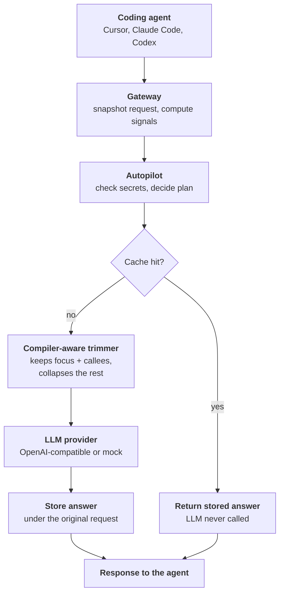
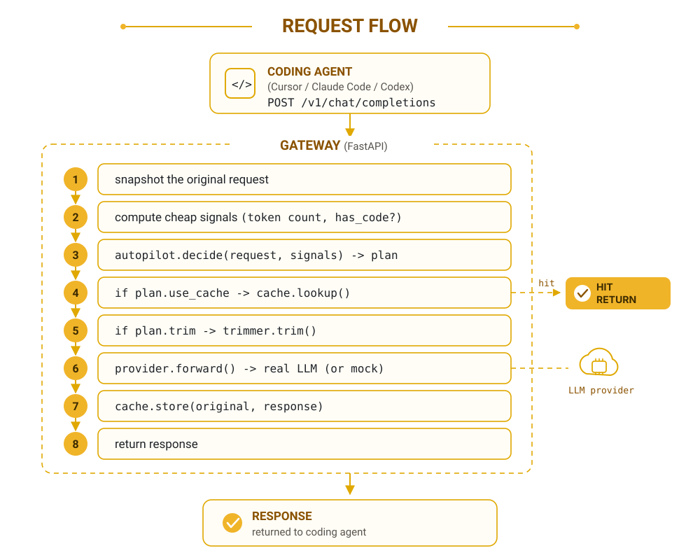
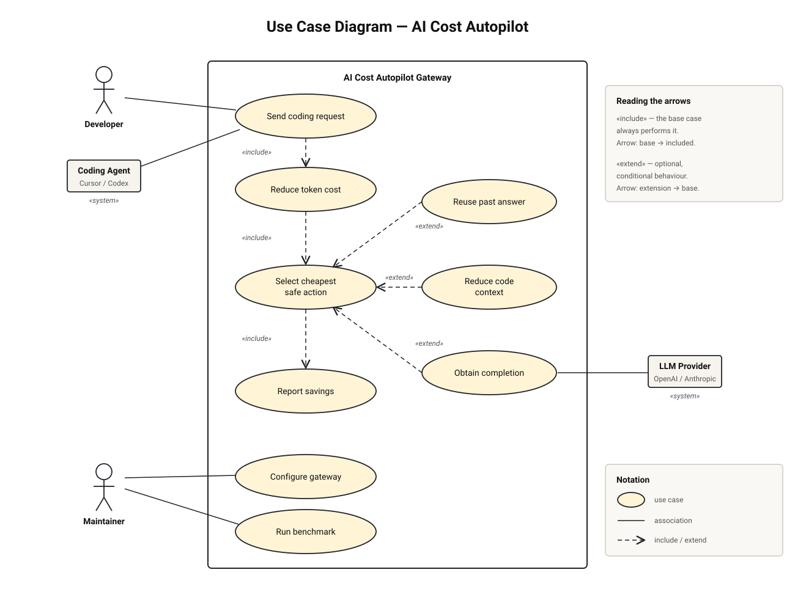
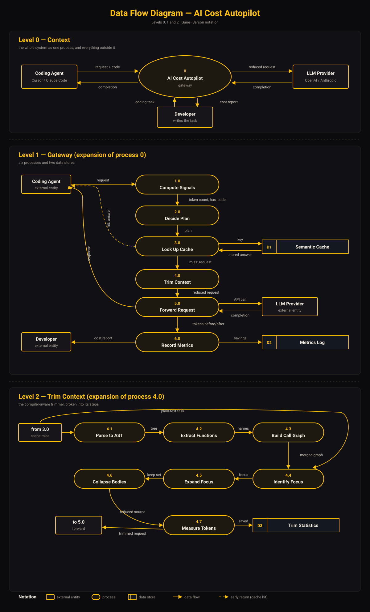
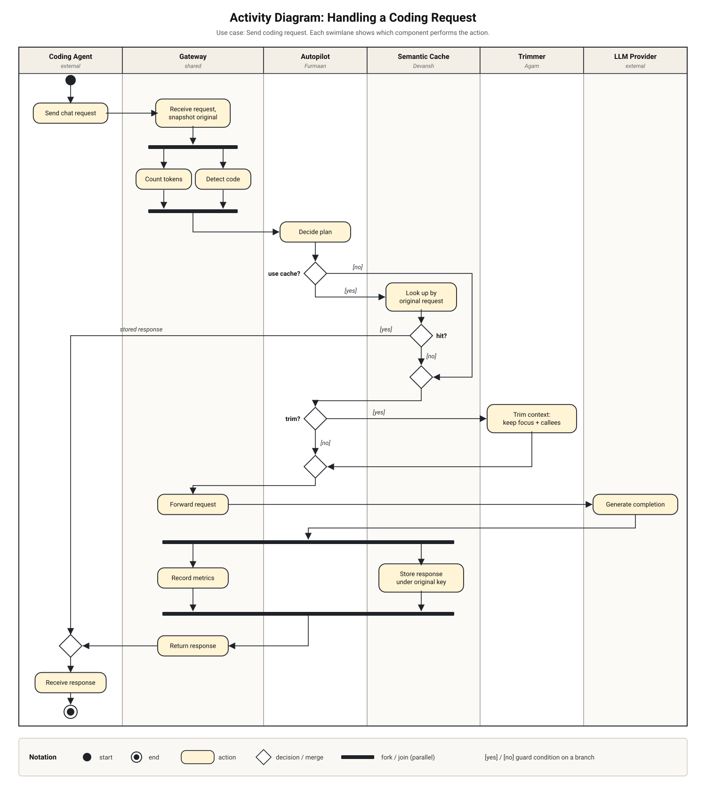
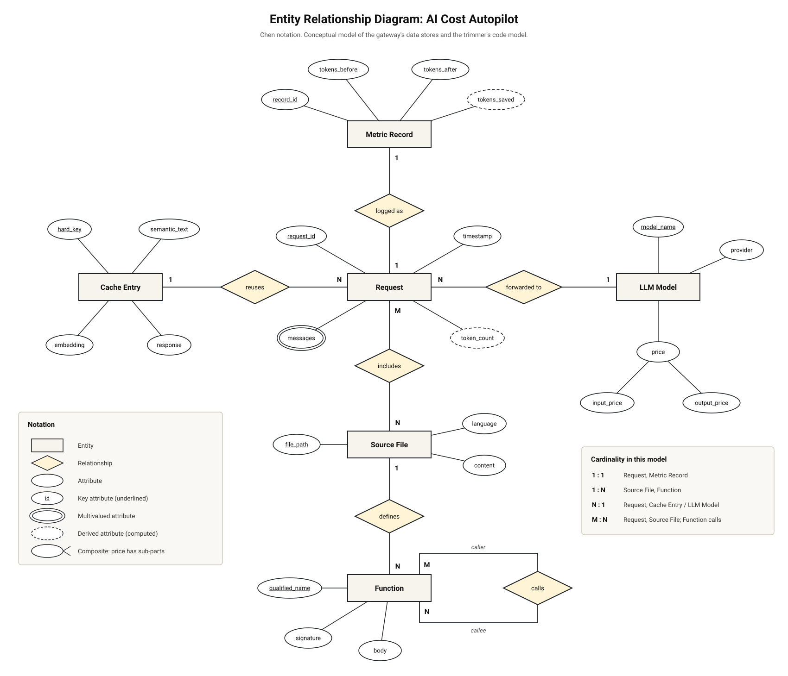
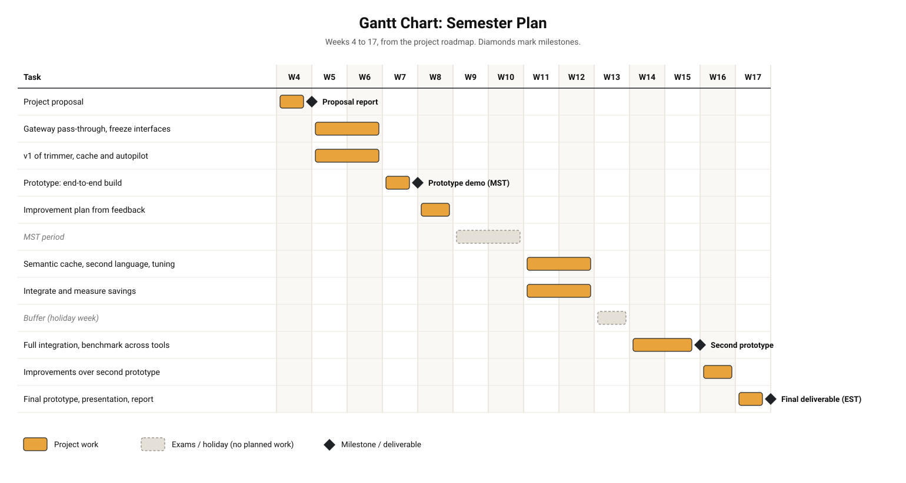

# AI Cost Autopilot

An OpenAI-compatible gateway that reduces the tokens AI coding agents send to an LLM, without changing the developer workflow.

[](https://github.com/agamlotey/ucs503p-202627-ai-cost-autopilot/actions/workflows/tests.yml)
[](https://agamlotey.github.io/ucs503p-202627-ai-cost-autopilot/)

[](LICENSE)

UCS503 Software Engineering project, Thapar Institute, 2026-27.

## The problem

AI coding agents repeatedly send large prompts, often including source code that is not relevant to the task. Repeated questions can also pay for the same provider response more than once. Simple text compression can break code, and a wrong semantic cache hit is worse than a miss. This project puts safe, measurable cost controls behind one OpenAI-compatible endpoint.

## How it works





## The three components

### Compiler-aware trimmer

**Owner: Agampreet Kaur (1024240033).** The trimmer parses Python with tree-sitter, builds a call graph across the supplied files, keeps the focus function and its callees in full, and collapses the rest to signatures. Its edits respect syntax boundaries, so its output remains valid Python.

### Semantic cache

**Owner: Devansh Sharma (1024240012).** The cache uses a hard key made from the model, parameters, message roles, and text. Exact matches always work. Similarity matching is restricted to prose because benchmarked code pairs do not have a safe cosine threshold; code uses exact matching only. Entries have a TTL and a size cap.

### Autopilot policy

**Owner: Furmaandeep Kaur (1024240029).** The autopilot chooses the safe path from inexpensive signals. It detects secrets, including multipart message content, and never caches them. It requests trimming for code-heavy requests, including secret-containing requests, because trimming does not cache the request.

## Results

All commands below run from `code/`.

| Area | Verified result | Measurement and reproduction |
|---|---|---|
| Trimmer | On the `notes_api` fixture for `fix create_note`, the trimmer used **33.9% fewer tokens** and kept valid Python. Baselines: strip comments and docstrings 20.5% (valid); strip indentation 9.0% (broken); collapse every body 57.0% (drops the code being fixed). Other tasks saved 47-55%. | Same fixture and task, with compilation checks: `python -m trimmer.benchmark.baselines` |
| Cache savings | Savings track repeat rate: 0% → 0%, 20% → 21%, 40% → 39%, 50% → 49%, 80% → 74%. | Synthetic 20-request sessions through the gateway logic: `python -m cache.benchmark.savings` |
| Code safety | No cosine threshold separates same-meaning code (0.881-1.000) from different-meaning code (0.609-0.985). Code is therefore exact-match only. | Labelled-pair threshold benchmark: `python -m cache.benchmark.run` |
| Cache latency | Exact hit: ~0.003 ms; prose miss: ~8.4 ms; one-time cold start: ~7.5 s. | Median cache overhead benchmark: `python -m cache.benchmark.latency` (requires `sentence-transformers`) |
| Secrets | 0 of 4,000 realistic `sk-proj` and `sk-ant` keys were missed. | Autopilot secret-detection tests and generated-key check |
| End to end | **63% fewer tokens on a scripted demo session**: cache saved 9,916 tokens and the trimmer saved 2,599 tokens. | `python demo.py` |
| Test suite | 65 tests; CI runs on every pull request. | `pytest -q` |

The 63% result is specific to the scripted demo session, which includes a repeated large request. It is not a general savings claim.

The earlier “about 25% fewer tokens” and “about 17% cheaper” figures were proof-of-concept results using Headroom and LiteLLM, not results from this system.

## Quick start

Run these commands from `code/`. Mock mode needs no API key and makes no provider call.

```bash
pip install -r requirements.txt
pytest -q
python demo.py
MOCK_PROVIDER=1 uvicorn gateway.app:app --port 8000
```

Point an OpenAI-compatible coding agent, such as Cursor, Claude Code, or Codex, at this base URL:

```text
http://localhost:8000/v1
```

Configuration is read from environment variables in [`code/gateway/config.py`](code/gateway/config.py):

| Variable | Purpose |
|---|---|
| `TOKEN_BUDGET` | The trimmer only cuts requests larger than this. Default: `1000`, matching the autopilot's trim threshold. |
| `MOCK_PROVIDER` | Use a canned local completion when `1`, `true`, or `yes`. Mock mode also activates when no provider API key is set. |
| `CACHE_MAX_ENTRIES` | Maximum cache entries. Default: `10000`. |
| `CACHE_TTL_SECONDS` | Sliding TTL in seconds. Empty by default, which disables expiry. |
| `PROVIDER_API_KEY` | API key for the upstream provider. |

## Design

The source PDFs for these diagrams are in [`docs/Diagrams/`](docs/Diagrams/).

### Use case

Shows the coding agent, gateway, provider, and the primary interactions.



<details>
<summary>Data-flow diagram</summary>

Shows the levels of data flow through the gateway, cache, trimmer, and provider.


</details>

<details>
<summary>Activity diagram</summary>

Shows the request decision path, including cache hits and trimming.


</details>

<details>
<summary>Entity-relationship diagram</summary>

Shows the planned data relationships for the system.


</details>

## Project status and roadmap

The gateway, Python trimmer, exact and prose-semantic cache paths, autopilot policy, mock provider, benchmarks, and CI are implemented. The gateway does not yet store metrics, and the trimmer currently supports Python only.

Next work includes autopilot threshold tuning, a metrics store, TypeScript support, and prefix caching for multi-turn chats.



## Repository layout

```text
.
├── code/                         # Gateway, trimmer, cache, autopilot, tests, and demo
├── docs/                         # Documentation site, component notes, and diagram PDFs
├── journals/                     # One journal.md folder per team member
├── project-proposal/             # Proposal source and PDF
├── project-report-prototype-stage/ # Prototype report source, PDF, and figures
├── project-report-final/         # Final report workspace
└── assets/                       # README and documentation images
```

## Team and project documents

| Member | Role | Area |
|---|---|---|
| Agampreet Kaur (1024240033) | Team member | Compiler-aware trimmer |
| Devansh Sharma (1024240012) | Team member | Semantic cache |
| Furmaandeep Kaur (1024240029) | Team member | Autopilot policy |

Lab instructor: Dr. Jeelani Asif.

- [Documentation site](https://agamlotey.github.io/ucs503p-202627-ai-cost-autopilot/)
- [Project proposal PDF](project-proposal/AI_Cost_Autopilot_Proposal.pdf)
- [Prototype report PDF](project-report-prototype-stage/AI_Cost_Autopilot_Report_Prototype.pdf)
- [Contribution guide](code/CONTRIBUTING.md)
